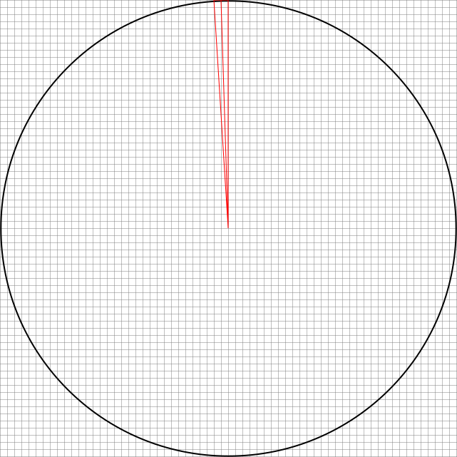

<body style="background: #FFF;">

# Spheara
The goal of the spheara project is to create a screen consisting of a one dimensional pixel array that is spun around with the help of a motor to create a two dimensional pixel matrix (i.e. a screen). The inspiration of the project comes from the [RBG Propeller Display](http://www.ohmbrew.net/prop-rgb/prop-rgb.shtml) made by Greg shown in the ["YOU WON'T BELIEVE YOUR EYES!" - Smarter Every Day 142](https://youtu.be/_FlV6pgwlrk) video.

## Requirements
- 64x64 Pixel Space
- Minimum of 25 rev/s

## Terminology
- Sword: The one dimensional pixel array.

## Methodology

### Control Loop Freqency
The control loop will be responsible for speed regulation and updating the pixels.

Imagine a quarter of the circular two dimensional screen created when the sword is spun. This quarter covers mostly of a 32x32 cartesian pixel space. The radius of this ciruclar display will be 32 pixels. The pixels need to be updated everytime the sword enters the next pixels from the regular 2D cartesian pixel space. It does this first at the very outer pixel.

Simplfied when the outer most pixel has traveled one pixel (arc length), the pixels need to be updated. This angle can thus be calculated as:\

The circular resolution is thus:\

Thus, the control loop frequency need to be:\

### LED Driver(s)
I've opted to use the [TLC5955](https://www.ti.com/lit/ds/symlink/tlc5955.pdf). It has 48 Channels, and can thus drive 16 RBG LEDs. So with two of these I can drive all 32 pixels.

It can be configured through it's 769 bits internal Common Shift Register. The Common Shift Register is alterned through Serial Port Input with a maximum rate of 25 Mbit/s. They can also be daisy chained, essentially just concatinating their registers.

To change the pixels the entire register needs to be rewritten every control loop cycle. The serial port bitrate needed to accomplish this can thus be calculated:\

Note, during this time we also need to perform other operations as well, such as retreieve sensor data, set control effort, calculations and estimations.

### Microcontroller
The chosen microcontroller is a Blue Pill (STM32F103C8T6).

Using SPI + DMA it can easily achieve a bitrate of 18 Mbit/s, which is more than sufficient.
